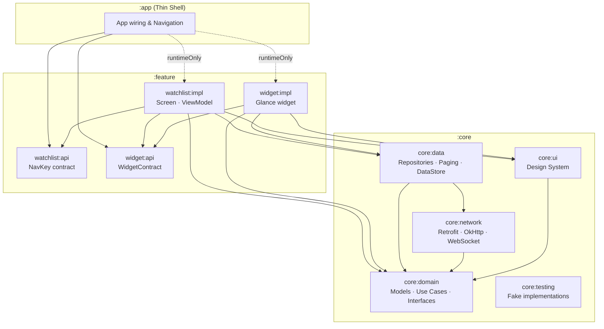

# Crypto Watchlist

An Android cryptocurrency watchlist app that streams live prices via WebSocket, lets users organise
coins into custom folders, and surfaces any folder as a home screen Glance widget.

This project follows a strict **multi-module "Now in Android" architecture** with Gradle convention
plugins and a clean separation of concerns across domain, data, network, UI, and feature layers.

---

## Screenshots

| Home                                                 | Add folder                                          | Bookmark Crypto                                          | Widget                                          |
|------------------------------------------------------|-----------------------------------------------------|----------------------------------------------------------|-------------------------------------------------|
|  |  |  |  |

---

## Architecture — Multi-Module Clean Architecture

The app is divided into functional layers and feature modules to optimise build times, enforce
encapsulation, and maximise testability. Each module only compiles what it needs.



---

## Module Structure

| Module                    | Purpose                                                                 | Package                                   |
|---------------------------|-------------------------------------------------------------------------|-------------------------------------------|
| `:app`                    | Hilt root, `MainActivity`, top-level navigation wiring                  | `com.abhay.crypto`                        |
| `:core:domain`            | Pure Kotlin JVM jar — models, repository interfaces, use cases          | `com.abhay.crypto.core.domain`            |
| `:core:network`           | Retrofit, OkHttp, WebSocket, `NetworkMonitorImpl`, DI                   | `com.abhay.crypto.core.network`           |
| `:core:data`              | Repository impls, `CoinPagingSource`, DataStore, DI bindings            | `com.abhay.crypto.core.data`              |
| `:core:ui`                | Shared design system — `CryptoTheme`, `Dimens`, all reusable components | `com.abhay.crypto.core.ui`                |
| `:core:testing`           | Fake implementations for unit tests — no mocking library needed         | `com.abhay.crypto.core.testing`           |
| `:feature:watchlist:api`  | Public contract — `WatchlistNavKey`                                     | `com.abhay.crypto.feature.watchlist.api`  |
| `:feature:watchlist:impl` | `WatchlistScreen`, `WatchlistViewModel`, dialogs, Hilt nav entry        | `com.abhay.crypto.feature.watchlist.impl` |
| `:feature:widget:api`     | Public contract — `WidgetContract` constants                            | `com.abhay.crypto.feature.widget.api`     |
| `:feature:widget:impl`    | `CryptoWidget`, `WidgetConfigurationActivity`, `WidgetUpdateWorker`     | `com.abhay.crypto.feature.widget.impl`    |
| `:build-logic`            | Gradle convention plugins — shared build configuration                  | `com.abhay.crypto.buildlogic`             |

---

## Key Architectural Patterns

### Feature API / Impl Split

Each feature is split into `:api` (public navigation contract) and `:impl` (full screen + logic).
`:app` depends on `:impl` modules via `runtimeOnly` only — it cannot accidentally import screens or
ViewModels at compile time. This enforces strict encapsulation and keeps `:app` as a thin shell.

### Navigation Multibinding (`@IntoSet`)

Features register their own nav entries via Hilt `@IntoSet` multibinding — `:app` never hard-codes
routes. Each feature module contributes a `NavEntryBuilder` to a `Set` that `MainActivity`
collects and iterates at runtime. Adding a new feature requires zero changes to `:app`.

### Domain Purity

`:core:domain` is compiled as a pure Kotlin JVM library with no `com.android.library` applied.
Any accidental `android.*` import causes a compile error — enforced by the module boundary, not
just a convention.

### Shared WebSocket Connection

`CoinRepositoryImpl` uses `shareIn` so all subscribers (`WatchlistViewModel` + `CryptoWidget`)
share **one** WebSocket connection regardless of how many collectors there are. An
`@ApplicationScope` coroutine scope (`SupervisorJob + Dispatchers.Default`) keeps the shared
flow alive across ViewModel recreations so the WebSocket is not torn down on rotation.

### Widget DI (Glance EntryPoint)

Glance widgets cannot use `@Inject` directly. `CryptoWidget` uses Hilt's `@EntryPoint` pattern to
pull `CoinRepository`, `FolderRepository`, `FormatPriceUseCase`, and `NetworkMonitor` from the
`SingletonComponent` manually at composition time.

### Testing with Fakes (no mocks)

`:core:testing` provides full fake implementations of every repository and service. Tests are
deterministic and fast — no reflection, no mockk/mockito required for the majority of unit tests.

---

## Build Logic — Convention Plugins

All shared Gradle configuration lives in `:build-logic:convention`. Each module's
`build.gradle.kts` applies only the plugins it needs — no boilerplate copy-paste across modules.

| Plugin ID                        | Used by                               | Includes                                 |
|----------------------------------|---------------------------------------|------------------------------------------|
| `crypto.android.application`     | `:app`                                | AGP app, Compose, Serialization, Jacoco  |
| `crypto.android.library`         | `:core:network`, `:core:data`         | AGP library, Kotlin Android, Java 17     |
| `crypto.android.library.compose` | `:core:ui`                            | Compose BOM + Material3 + tooling        |
| `crypto.android.feature.api`     | `:feature:*:api`                      | library + Serialization                  |
| `crypto.android.feature.impl`    | `:feature:*:impl`                     | library + Compose + Hilt + Nav3 + Paging |
| `crypto.hilt`                    | `:app`, `:core:network`, `:core:data` | KSP + Hilt Android                       |
| `crypto.jvm.library`             | `:core:domain`                        | Pure Kotlin JVM, Java 17                 |
| `crypto.android.detekt`          | All modules                           | Detekt with shared `detekt.yml` config   |

---

## Data Pipeline — Price Update Flow

```
1. App start       → CoinPagingSource fetches REST prices → seeds restPriceCache
2. WebSocket open  → BinanceWebSocketService emits live price ticks
3. Combine         → CoinRepositoryImpl merges (restCache + livePrices) into sharedLivePrices
4. ViewModel       → collectAsStateWithLifecycle() drives UI recomposition
5. Widget          → CryptoWidget collects same sharedLivePrices flow via EntryPoint
6. Background      → WidgetUpdateWorker (WorkManager, every 15 min) triggers widget refresh
```

---

## Tech Stack

| Category        | Library                                  | Version     |
|-----------------|------------------------------------------|-------------|
| Language        | Kotlin                                   | 2.3.20      |
| Build           | Android Gradle Plugin                    | 9.1.1       |
| Build           | KSP                                      | 2.3.6       |
| UI              | Compose BOM                              | 2026.03.01  |
| UI              | Material 3                               | BOM-managed |
| Navigation      | Navigation 3                             | 1.1.0       |
| DI              | Hilt Android                             | 2.59.2      |
| Networking      | Retrofit                                 | 3.0.0       |
| Networking      | OkHttp                                   | 5.3.2       |
| Serialization   | kotlinx-serialization-json               | 1.11.0      |
| Pagination      | Paging Compose                           | 3.4.2       |
| Persistence     | DataStore Preferences                    | 1.2.1       |
| Widget          | Glance AppWidget                         | 1.1.1       |
| Background      | WorkManager                              | 2.11.2      |
| Static Analysis | Detekt                                   | 1.23.8      |
| Testing         | JUnit 4, Turbine, Coroutines Test, MockK | —           |

---

## Build & Verify

```bash
# Build
./gradlew assembleDebug

# Run all unit tests
./gradlew testDebugUnitTest

# Run tests for a specific module
./gradlew :core:data:testDebugUnitTest
./gradlew :feature:watchlist:impl:testDebugUnitTest

# Verify domain purity — must compile with zero android.* imports
./gradlew :core:domain:compileKotlin

# Static analysis
./gradlew detekt

# Build convention plugins
./gradlew :build-logic:convention:assemble
```
