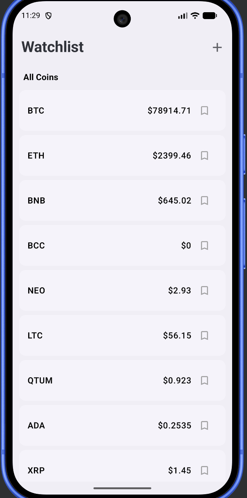
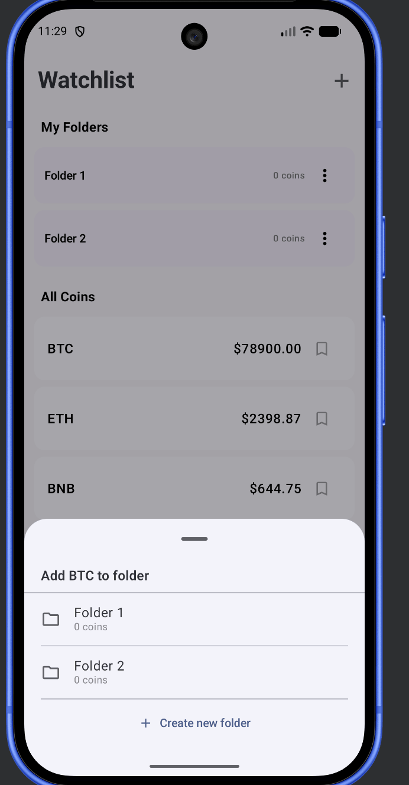
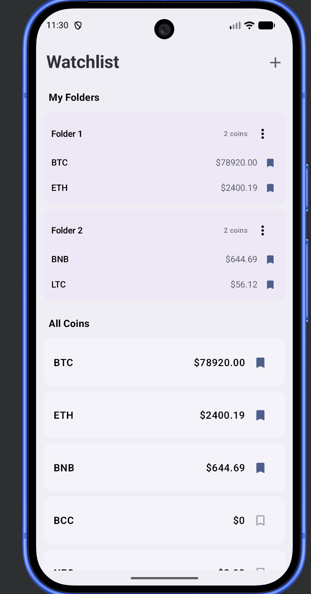
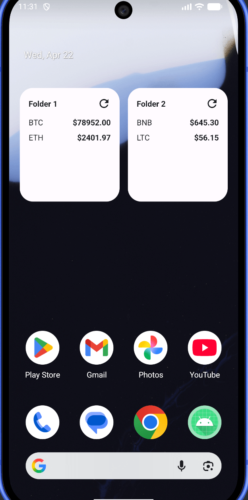

# Crypto Watchlist

An Android cryptocurrency watchlist app that streams live prices via WebSocket, lets users organise
coins into custom folders, and surfaces any folder as a home screen Glance widget.

---

---

## Screenshots

| Home                                                 | Add folder                                          | Bookmark-Crypto                                          | Screen-Widget                                   |
|------------------------------------------------------|-----------------------------------------------------|----------------------------------------------------------|-------------------------------------------------|
|  |  |  |  |

---

## Architecture — Clean Architecture layers

```
┌─────────────────────────────────────────────────────────┐
│                    PRESENTATION                         │
│  Compose UI  ◄──  ViewModel  ◄──  UseCase results      │
│  (WatchlistScreen, Glance Widget, Components)           │
└───────────────────────┬─────────────────────────────────┘
                        │  calls UseCases
┌───────────────────────▼─────────────────────────────────┐
│                      DOMAIN                             │
│  UseCases   Repository interfaces   Models              │
│  (pure Kotlin — zero Android imports)                   │
└──────────┬─────────────────────────────┬────────────────┘
           │ implements                  │ implements
┌──────────▼──────────┐   ┌─────────────▼──────────────┐
│     DATA (remote)   │   │     DATA (local)            │
│  Retrofit REST      │   │  DataStore Preferences      │
│  OkHttp WebSocket   │   │  (folders + watchlist)      │
│  Paging Source      │   │  NetworkMonitor             │
└─────────────────────┘   └────────────────────────────-┘
```

**Dependency rule:** arrows point inward only. Presentation knows Domain; Domain knows nothing
outside itself; Data implements Domain interfaces.

---

## Tech Stack

| Category        | Library                                  | Version       |
|-----------------|------------------------------------------|---------------|
| Language        | Kotlin                                   | 2.3.20        |
| Build           | Android Gradle Plugin                    | 9.1.1         |
| Build           | KSP                                      | 2.3.6         |
| UI              | Compose BOM                              | 2026.03.01    |
| UI              | Material 3                               | (BOM-managed) |
| UI              | Material Icons Extended                  | (BOM-managed) |
| Navigation      | Navigation 3 runtime                     | 1.1.0         |
| Navigation      | Navigation 3 UI                          | 1.1.0         |
| Navigation      | lifecycle-viewmodel-navigation3          | 2.10.0        |
| Navigation      | Hilt Navigation Compose                  | 1.3.0         |
| DI              | Hilt Android                             | 2.59.2        |
| Networking      | Retrofit                                 | 3.0.0         |
| Networking      | Retrofit kotlinx-serialization converter | 3.0.0         |
| Networking      | OkHttp                                   | 5.3.2         |
| Networking      | OkHttp Logging Interceptor               | 5.3.2         |
| Serialization   | kotlinx-serialization-json               | 1.11.0        |
| Pagination      | Paging Compose                           | 3.4.2         |
| Persistence     | DataStore Preferences                    | 1.2.1         |
| Image loading   | Coil Compose                             | 2.7.0         |
| Widget          | Glance AppWidget                         | 1.1.1         |
| Widget          | Glance Material 3                        | 1.1.1         |
| Static analysis | Detekt                                   | 1.23.8        |
| Testing         | JUnit 4                                  | 4.13.2        |
| Testing         | MockK                                    | 1.14.9        |
| Testing         | kotlinx-coroutines-test                  | 1.10.2        |
| Testing         | Turbine                                  | 1.2.1         |
| Testing         | Hilt Testing                             | 2.59.2        |

---

## Full File Structure

```
app/src/main/java/com/abhay/crypto/
│
├── CryptoApp.kt                            @HiltAndroidApp — application entry point
├── MainActivity.kt                         @AndroidEntryPoint, enableEdgeToEdge, hosts NavDisplay
│
├── domain/                                 ── Pure Kotlin. No android.* imports. ──
│   ├── model/
│   │   ├── Coin.kt                         data class(symbol, baseAsset, price: Double)
│   │   └── BookmarkFolder.kt              @Serializable data class(id, name, coinIds: List<String>)
│   ├── NetworkMonitor.kt                   interface { val isAvailable: Flow<Boolean> }
│   ├── repository/
│   │   ├── CoinRepository.kt               getPagedCoins(), observeLivePrices(), getCoinsByIds()
│   │   ├── FolderRepository.kt             CRUD for BookmarkFolder + coin membership ops
│   │   └── WatchListRepository.kt          getWatchListed(): Flow<Set<String>>, toggle(symbol)
│   └── usecase/
│       ├── GetPagedCoinsUseCase.kt          delegates to CoinRepository.getPagedCoins()
│       ├── ObserveLivePricesUseCase.kt      delegates to CoinRepository.observeLivePrices()
│       ├── ObserveNetworkUseCase.kt         delegates to NetworkMonitor.isAvailable
│       ├── GetWatchListedUseCase.kt         delegates to WatchListRepository.getWatchListed()
│       ├── ToggleWatchListUseCase.kt        delegates to WatchListRepository.toggle()
│       ├── FormatPriceUseCase.kt           formats Double → "$x.xx" or up to 8dp; Locale.US
│       └── folder/
│           ├── GetFoldersUseCase.kt
│           ├── CreateFolderUseCase.kt       invoke(name, coinId? = null)
│           ├── RenameFolderUseCase.kt
│           ├── DeleteFolderUseCase.kt
│           ├── AddBookmarkToFolderUseCase.kt
│           └── RemoveBookmarkFromFolderUseCase.kt
│
├── data/
│   ├── remote/
│   │   ├── BinanceApi.kt                   Retrofit interface — GET /api/v3/ticker/price
│   │   ├── BinanceWebSocketService.kt      wss://stream.binance.com:9443/ws/!miniTicker@arr
│   │   │                                   callbackFlow + .retry { delay(5_000); true }
│   │   └── dto/
│   │       ├── TickerPriceDto.kt           @Serializable — REST response shape
│   │       └── MiniTickerDto.kt            @Serializable — WebSocket tick shape
│   ├── paging/
│   │   └── CoinPagingSource.kt             PagingSource; populates restPriceCache on first load;
│   │                                       returns LoadResult.Error on network failure
│   ├── repository/
│   │   └── CoinRepositoryImpl.kt           Pager(pageSize=10, prefetch=2);
│   │                                       merges REST cache + WebSocket via combine()
│   ├── folder/
│   │   └── FolderRepositoryImpl.kt         DataStore-backed; serializes List<BookmarkFolder> as JSON
│   ├── local/
│   │   └── WatchListRepositoryImpl.kt      DataStore stringSetPreferencesKey("watch_listed")
│   ├── network/
│   │   └── NetworkMonitorImpl.kt           ConnectivityManager callbackFlow;
│   │                                       uses NET_CAPABILITY_INTERNET only (not VALIDATED)
│   └── mapper/
│       └── CoinMapper.kt                   TickerPriceDto → Coin domain model
│
├── di/
│   ├── NetworkModule.kt                    OkHttpClient, Retrofit, BinanceApi, WebSocketService
│   ├── DataStoreModule.kt                  single DataStore<Preferences> via Context extension
│   └── RepositoryModule.kt                @Binds for Coin/Folder/WatchList repos + NetworkMonitor
│
├── presentation/
│   ├── theme/
│   │   ├── Color.kt                        Material 3 seed colours
│   │   ├── Type.kt                         Typography overrides
│   │   └── Theme.kt                        CryptoTheme — dynamic colour on API 31+
│   ├── navigation/
│   │   ├── WatchlistNavKey.kt              @Serializable data object — sole nav destination
│   │   ├── Navigator.kt                    thin wrapper around MutableList<NavKey>
│   │   └── AppNavGraph.kt                  rememberNavBackStack + NavDisplay entry decorators
│   ├── components/
│   │   ├── CoinListItem.kt                 Card — baseAsset + live price + bookmark icon
│   │   ├── FolderItem.kt                   Card — folder name, coin rows, options dropdown
│   │   ├── AddToFolderBottomSheet.kt       ModalBottomSheet — folder picker with added/not state
│   │   ├── CreateFolderDialog.kt           AlertDialog + OutlinedTextField
│   │   ├── RenameFolderDialog.kt           Pre-filled dialog; confirm disabled if name unchanged
│   │   ├── RemoveCoinDialog.kt             Confirmation before removing a coin from a folder
│   │   ├── LoadingView.kt                  Centred CircularProgressIndicator
│   │   ├── ErrorView.kt                    Network vs generic error; wifi-off icon; retry button
│   │   └── NetworkBanner.kt               errorContainer strip shown when offline
│   ├── watchlist/
│   │   ├── WatchlistEntry.kt               Nav3 entry — fun EntryProviderScope<NavKey>.watchlistEntry()
│   │   ├── WatchlistNavKey.kt              (see navigation/)
│   │   ├── WatchlistUiState.kt             data class — isNetworkAvailable, folders, coinIdsInFolders
│   │   ├── WatchlistUiEvent.kt             sealed interface — all user intents
│   │   ├── WatchlistActions.kt             data class bundling lambdas passed to WatchlistList
│   │   ├── WatchlistDialogState.kt         @Stable class — mutableStateOf fields for dialog visibility
│   │   ├── WatchlistViewModel.kt           @HiltViewModel — pagedCoins, livePrices, uiState StateFlows
│   │   └── WatchlistScreen.kt             WatchlistScreen → WatchlistContent → WatchlistList
│   └── glance/
│       └── widget/
│           ├── CryptoWidget.kt             GlanceAppWidget — reads folderId pref, fetches coins
│           ├── CryptoWidgetUI.kt           Glance Composable — folder name + up to 5 coin rows
│           ├── CryptoWidgetReceiver.kt     GlanceAppWidgetReceiver — provides CryptoWidget()
│           ├── RefreshActionCallback.kt    GlanceActionCallback — triggers widget update on tap
│           ├── WidgetConfigurationActivity.kt  @AndroidEntryPoint; shown on home-screen add flow;
│           │                                   lets user pick folder before widget is placed
│           └── WidgetPinReceiver.kt        BroadcastReceiver for requestPinAppWidget callback;
│                                           saves folderId + triggers first render
```

---

## Data Pipeline — Price Update Flow

```
Step 1  App start
        └─► CoinPagingSource.load()
                │  calls GET /api/v3/ticker/price
                │  filters to *USDT pairs
                ├─► emits first page of Coin to LazyPagingItems (UI shows coin list)
                └─► populates restPriceCache: MutableStateFlow<Map<String,Double>>
                        (every coin has a real price — no $0 flash)

Step 2  WebSocket connects
        └─► BinanceWebSocketService.observePrices()
                │  wss://stream.binance.com:9443/ws/!miniTicker@arr
                │  emits Map<symbol, closePrice> on every server tick
                └─► on disconnect: .retry { delay(5_000); true } auto-reconnects

Step 3  Price merge (CoinRepositoryImpl)
        combine(restPriceCache, webSocket) { rest, live ->
            rest + live          ← WebSocket values override REST baseline
        }
        └─► livePrices: StateFlow<Map<String,Double>>  (WhileSubscribed 5 s timeout)

Step 4  UI reads prices
        ├─► CoinListItem  — priceProvider lambda reads livePrices[symbol]
        └─► FolderItem    — same lambda; REST cache ensures price is non-zero before first tick

Step 5  Widget reads prices
        └─► CryptoWidget.provideGlance()
                │  injects CoinRepository via EntryPoints (Hilt in Glance)
                └─► calls getCoinsByIds(folder.coinIds) → runCatching REST call
                        combines with live WebSocket prices for display
```

---

## Domain Models

| Model            | Fields                                                       | Storage                             | Notes                                                                  |
|------------------|--------------------------------------------------------------|-------------------------------------|------------------------------------------------------------------------|
| `Coin`           | `symbol: String`, `baseAsset: String`, `price: Double`       | In-memory only                      | Mapped from `TickerPriceDto`; `baseAsset` = symbol minus "USDT" suffix |
| `BookmarkFolder` | `id: String` (UUID), `name: String`, `coinIds: List<String>` | DataStore JSON                      | `@Serializable`; a coin can belong to multiple folders                 |
| Watchlist        | `Set<String>` of symbols                                     | DataStore `stringSetPreferencesKey` | Persisted separately from folders                                      |

---

## Key Design Decisions

**REST price cache seeds the live stream**
`CoinPagingSource` stores every REST price into `restPriceCache` on first load.
`observeLivePrices()` merges this with the WebSocket via `combine(rest, live) { r, l -> r + l }`.
Result: folder items never show $0 even before the first WebSocket tick arrives.

**`NET_CAPABILITY_INTERNET` only, not `NET_CAPABILITY_VALIDATED`**
`VALIDATED` requires Android's captive-portal probe to succeed — absent on many corporate Wi-Fi
networks and VPNs. Using only `INTERNET` gives reliable online/offline detection across real
devices.

**Paging error surfaced via `LoadResult.Error`, not a thrown exception**
Moving the Retrofit call inside `CoinPagingSource.load()` wrapped in `try/catch` means failures
become `LoadResult.Error` and surface as `LoadState.Error` in the UI. Throwing outside the
PagingSource would crash `viewModelScope`.

**`WatchlistDialogState` — stable class with `mutableStateOf` fields**
Grouping the four dialog visibility vars into a `@Stable` class reduces `WatchlistDialogs` from 10
parameters (detekt `LongParameterList`) to 3, without losing Compose state tracking or adding
`Saver` boilerplate.

**Widget — two pinning paths share the same state key**
Both `WidgetConfigurationActivity` (home-screen long-press) and `WidgetPinReceiver` (in-app
`requestPinAppWidget` callback) write to the same `CryptoWidget.FOLDER_ID_KEY` Glance preference and
call `CryptoWidget().update()`. The widget rendering code is therefore path-agnostic.

**`AddBookmarkToFolder` event is a toggle**
If the coin is already in the requested folder, the ViewModel calls `removeBookmarkFromFolder`;
otherwise `addBookmarkToFolder`. The bottom sheet shows a ✓ checkmark on folders that already
contain the coin so the user understands the toggle behaviour before tapping.

---

## Build

```bash
./gradlew assembleDebug     # compile debug APK
./gradlew installDebug      # install on connected device/emulator (API 26+)
./gradlew test              # unit tests
./gradlew detekt            # static analysis
```
